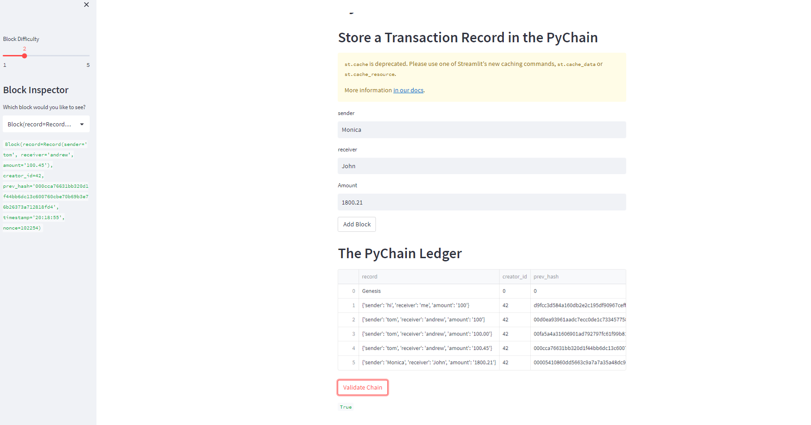

# Blockchain-based-ledger

Using Python and streamlit to create a blockchain based ledger. The code creates a Block class with various properties such as idex, timestamp and data.
By linking multiple Block objects together using their previous_hash attributes, we can create a chain of blocks.
I modified the provided Block data to include the following input fileds to the streamlit interface.
* Sender
* Receiver
* Amount

The User information is hashed and stored into the PyChain Ledger. 

## Validating the record using the drop down menu

## Validating the record using the validation button.

## Blockchain Ledger

The Streamlit interface allows you to input data such as block index, timestamp, sender, receiver and amount, and it will display the hash value of the new block once it's added to the blockchain. The first block in the chain, known as the Genesis block, has a previous_hash of 0.

With this setup, you can create a secure and transparent way to manage and track data. 